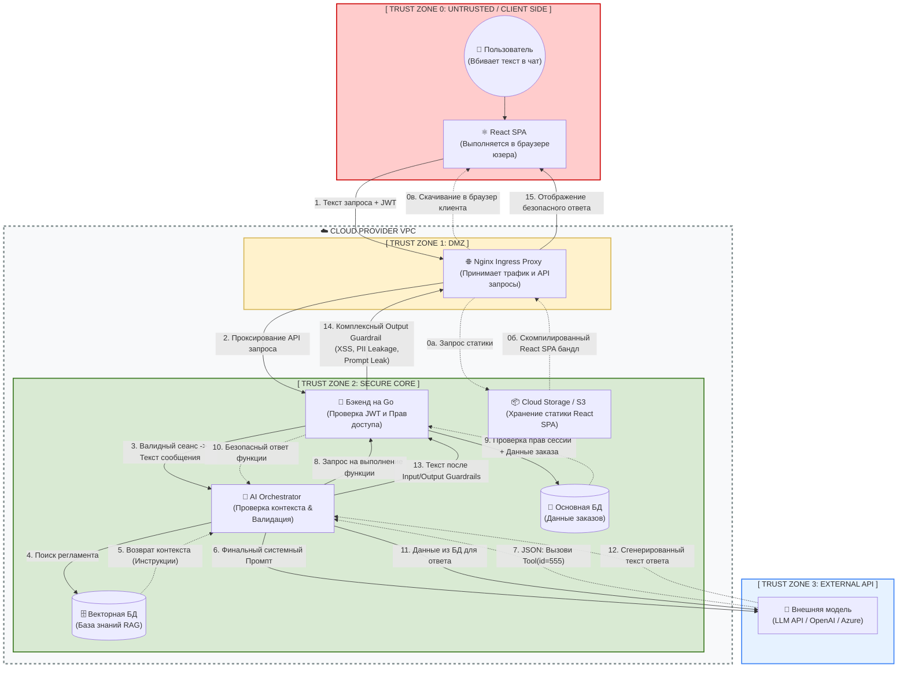

```mermaid
graph TB
    %% Настройка стилей для зон безопасности
    classDef untrusted fill:#ffcccc,stroke:#cc0000,stroke-width:2px;
    classDef dmz fill:#fff2cc,stroke:#d6b656,stroke-width:2px;
    classDef secure fill:#d9ead3,stroke:#38761d,stroke-width:2px;
    classDef external fill:#e6f2ff,stroke:#3b82f6,stroke-width:2px;

    %% ZONE 0: Сторона клиента (Браузер пользователя)
    subgraph ZONE_0["[ TRUST ZONE 0: UNTRUSTED / CLIENT SIDE ]"]
        User(("👤 Пользователь <br> (Вбивает текст в чат)"))
        ReactSPA["⚛️ React SPA <br> (Выполняется в браузере юзера)"]
        User --> ReactSPA
    end
    class ZONE_0 untrusted;

    %% ГРАНИЦА ОБЛАКА (Cloud Provider VPC)
    subgraph CLOUD_VPC["☁️ CLOUD PROVIDER VPC"]
        style CLOUD_VPC fill:#f8f9fa,stroke:#7f8c8d,stroke-width:3px,stroke-dasharray: 5 5

        %% ZONE 1: Nginx (Публичная подсеть / DMZ)
        subgraph ZONE_1["[ TRUST ZONE 1: DMZ ]"]
            Nginx["🌐 Nginx Ingress Proxy <br> (Принимает трафик и API запросы)"]
        end
        class ZONE_1 dmz;

        %% ZONE 2: Защищенный контур приложения (Приватная подсеть)
        subgraph ZONE_2["[ TRUST ZONE 2: SECURE CORE ]"]
            GoBackend["🐹 Бэкенд на Go <br> (Проверка JWT и Прав доступа)"]
            GoOrchestrator["🤖 AI Orchestrator <br> (Проверка контекста & Валидация)"]
            
            VectorDB[("🗄️ Векторная БД <br> (База знаний RAG)")]
            AppDB[("💾 Основная БД <br> (Данные заказов)")]
            
            %% Место хранения фронтенда в облаке
            CloudStorage["📦 Cloud Storage / S3 <br> (Хранение статики React SPA)"]
        end
        class ZONE_2 secure;
    end

    %% ZONE 3: Внешний ИИ (За пределами облака компании)
    subgraph ZONE_3["[ TRUST ZONE 3: EXTERNAL API ]"]
        ExternalLLM["🧠 Внешняя модель <br> (LLM API / OpenAI / Azure)"]
    end
    class ZONE_3 external;

    %% ==========================================
    %% ПОТОК ДАННЫХ (DATA FLOW СЕССИИ)
    %% ==========================================
    
    %% Нулевой этап: Загрузка приложения при первом заходе
    Nginx -. "0а. Запрос статики" .-> CloudStorage
    CloudStorage -. "0б. Скомпилированный React SPA бандл" .-> Nginx
    Nginx -. "0в. Скачивание в браузер клиента" .-> ReactSPA

    %% Шаг 1-3: Отправка сообщения из чата в бэкенд
    ReactSPA -- "1. Текст запроса + JWT" --> Nginx
    Nginx -- "2. Проксирование API запроса" --> GoBackend
    
    %% Шаг 4: Бэкенд отдает в оркестратор
    GoBackend -- "3. Валидный сеанс -> Текст сообщения" --> GoOrchestrator
    
    %% Шаг 5-6: Обогащение контекста (RAG)
    GoOrchestrator -- "4. Поиск регламента" --> VectorDB
    VectorDB -. "5. Возврат контекста (Инструкции)" .-> GoOrchestrator
    
    %% Шаг 7: Сборка промпта и отправка в модель
    GoOrchestrator -- "6. Финальный системный Промпт" --> ExternalLLM
    
    %% Шаг 8: Модель запрашивает вызов функции (Tool Calling)
    ExternalLLM -. "7. JSON: Вызови Tool(id=555)" .-> GoOrchestrator
    
    %% Шаг 9-11: Оркестратор просит бэкенд выполнить функцию БЕЗОПАСНО (С верификацией прав)
    GoOrchestrator -- "8. Запрос на выполнение функции" --> GoBackend
    GoBackend --> AppDB
    AppDB -. "9. Проверка прав сессии + Данные заказа" .-> GoBackend
    GoBackend -. "10. Безопасный ответ функции" .-> GoOrchestrator
    
    %% Шаг 12-13: Пересборка ответа через модель
    GoOrchestrator -- "11. Данные из БД для ответа" --> ExternalLLM
    ExternalLLM -. "12. Сгенерированный текст ответа" .-> GoOrchestrator
    
    %% Шаг 14-16: Комплексный контроль вывода и возврат пользователю
    GoOrchestrator -- "13. Текст после Input/Output Guardrails" --> GoBackend
    GoBackend -- "14. Комплексный Output Guardrail <br> (XSS, PII Leakage, Prompt Leak)" --> Nginx
    Nginx -- "15. Отображение безопасного ответа" --> ReactSPA
```
