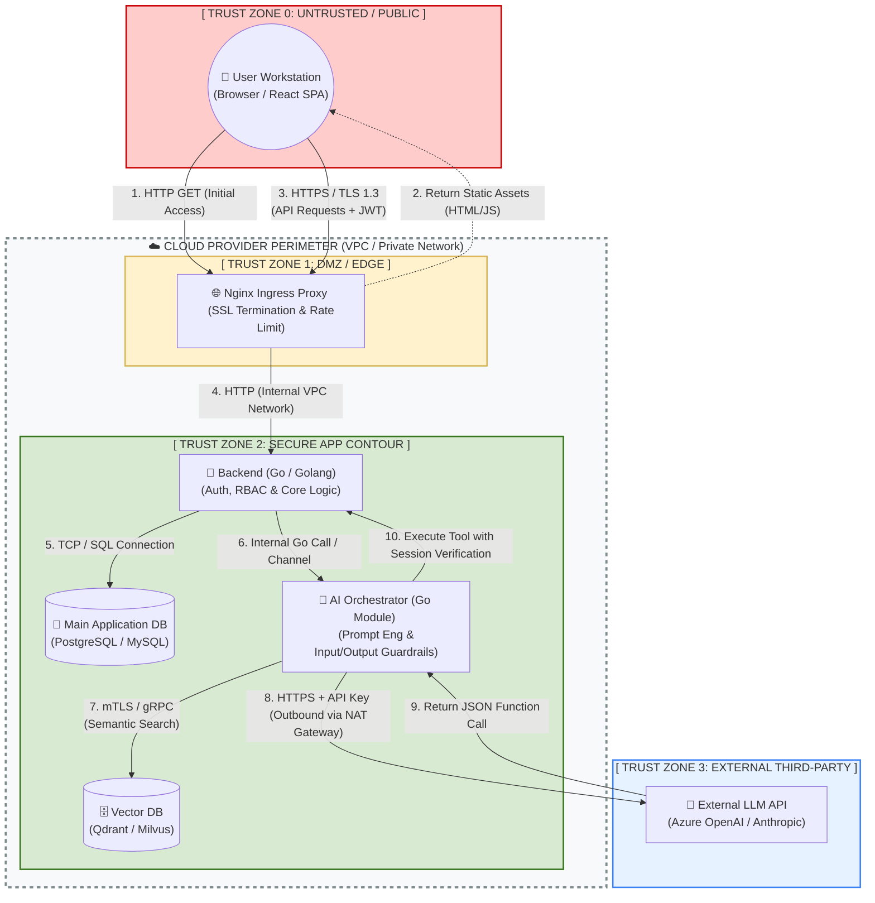

```mermaid
graph TB
    %% Настройка стилей для зон безопасности
    classDef untrusted fill:#ffcccc,stroke:#cc0000,stroke-width:2px;
    classDef dmz fill:#fff2cc,stroke:#d6b656,stroke-width:2px;
    classDef secure fill:#d9ead3,stroke:#38761d,stroke-width:2px;
    classDef external fill:#e6f2ff,stroke:#3b82f6,stroke-width:2px;

    %% ZONE 0: Вне облака (У пользователя)
    subgraph ZONE_0["[ TRUST ZONE 0: UNTRUSTED / PUBLIC ]"]
        User(("👤 User Workstation <br> (Browser / React SPA)"))
    end
    class ZONE_0 untrusted;

    %% ГРАНИЦА ОБЛАКА (Cloud Provider VPC / K8s Cluster)
    subgraph CLOUD_VPC["☁️ CLOUD PROVIDER PERIMETER (VPC / Private Network)"]
        style CLOUD_VPC fill:#f8f9fa,stroke:#7f8c8d,stroke-width:3px,stroke-dasharray: 5 5

        %% ZONE 1: Публичная подсеть облака (DMZ)
        subgraph ZONE_1["[ TRUST ZONE 1: DMZ / EDGE ]"]
            Nginx["🌐 Nginx Ingress Proxy <br> (SSL Termination & Rate Limit)"]
        end
        class ZONE_1 dmz;

        %% ZONE 2: Приватная подсеть облака (Защищенный контур)
        subgraph ZONE_2["[ TRUST ZONE 2: SECURE APP CONTOUR ]"]
            GoBackend["🐹 Backend (Go / Golang) <br> (Auth, RBAC & Core Logic)"]
            AppDB[("💾 Main Application DB <br> (PostgreSQL / MySQL)")]
            
            %% AI-компоненты внутри приватного периметра
            GoOrchestrator["🤖 AI Orchestrator (Go Module) <br> (Prompt Eng & Input/Output Guardrails)"]
            VectorDB[("🗄️ Vector DB <br> (Qdrant / Milvus)")]
        end
        class ZONE_2 secure;
        
    end

    %% ZONE 3: Внешние API (За пределами твоего облака)
    subgraph ZONE_3["[ TRUST ZONE 3: EXTERNAL THIRD-PARTY ]"]
        ExternalLLM["🧠 External LLM API <br> (Azure OpenAI / Anthropic)"]
    end
    class ZONE_3 external;

    %% ==========================================
    %% ПОТОКИ ДАННЫХ И ПРОТОКОЛЫ (DATA FLOW)
    %% ==========================================
    
    %% Первый заход: Скачивание SPA
    User -- "1. HTTP GET (Initial Access)" --> Nginx
    Nginx -. "2. Return Static Assets (HTML/JS)" .-> User
    
    %% API-взаимодействие (После загрузки React в браузер)
    User -- "3. HTTPS / TLS 1.3 <br> (API Requests + JWT)" --> Nginx
    Nginx -- "4. HTTP (Internal VPC Network)" --> GoBackend
    
    %% Классическая бизнес-логика
    GoBackend -- "5. TCP / SQL Connection" --> AppDB
    
    %% Логика работы ИИ-модуля (RAG)
    GoBackend -- "6. Internal Go Call / Channel" --> GoOrchestrator
    GoOrchestrator -- "7. mTLS / gRPC <br> (Semantic Search)" --> VectorDB
    
    %% Выход во внешний мир за ответом модели
    GoOrchestrator -- "8. HTTPS + API Key <br> (Outbound via NAT Gateway)" --> ExternalLLM
    
    %% Обратный вызов функций (Tool Calling)
    ExternalLLM -- "9. Return JSON Function Call" --> GoOrchestrator
    GoOrchestrator -- "10. Execute Tool with Session Verification" --> GoBackend
```
